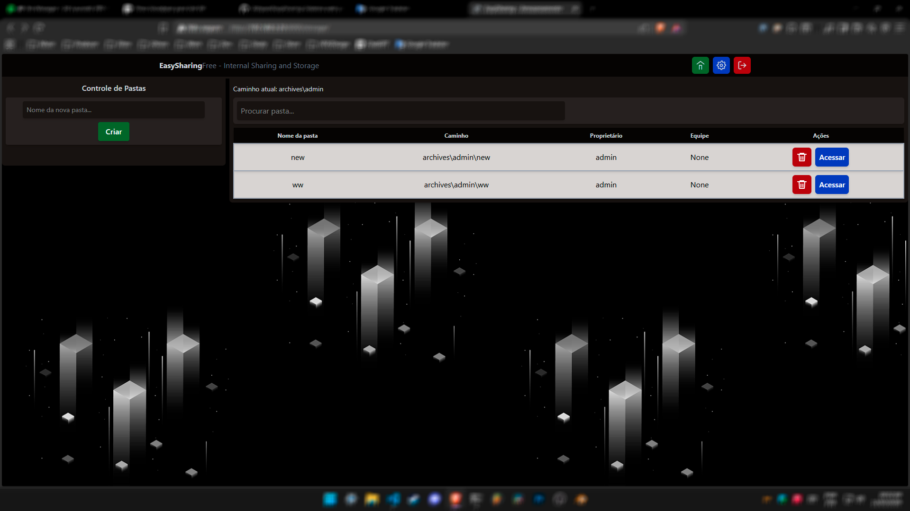

# EasySharing*Free* - _Internal Sharing and Storage_

> É um sistema web para compartilhar e armazenar arquivos diversos, sendo de utilização em redes internas como redes domesticas ou de ambientes de trabalho.
> Sendo uma evolução do meu antigo projeto FileBrowserDjango o sistema inda esta sendo desenvolvido mais ja possue uma versão de teste que pode ser usada.

---

---
